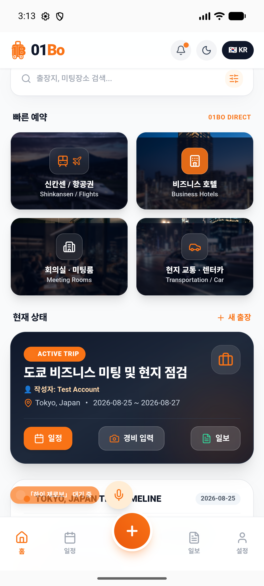
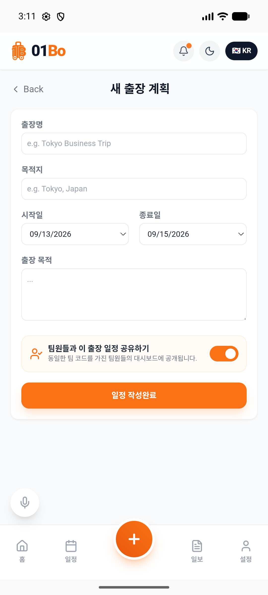
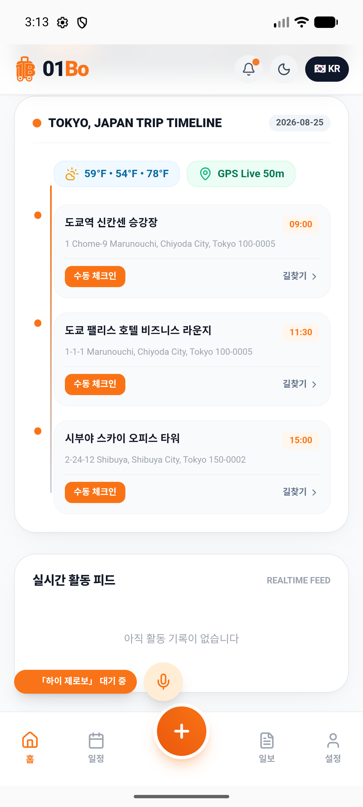
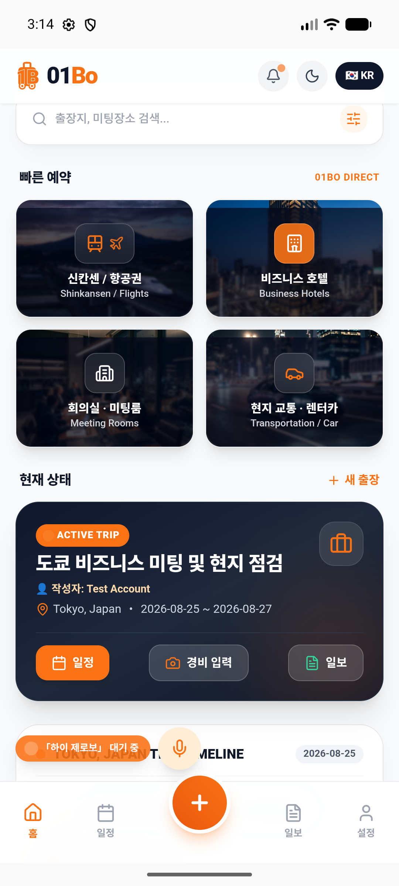

# 📱 O1BO (Zero-One Business Officer) - AWS 기반 스마트 출장 관리 및 근태 확인 시스템

> **AWS Cloud Infrastructure & Database REST API** 기반의 고성능/안전한 데이터 관리, **Google Gemini AI** 기반 지능형 출장 일정 자동 생성, **GPS & NFC 2중 인증** 기반 근태 확인, 영수증 OCR 경비 정산 및 **기업 전용 데이터 보안 분리 메커니즘**을 갖춘 차세대 스마트 하이브리드 출장 관리 어플리케이션입니다.

---

## 📸 실제 구동 화면 (Live Device & Emulator Screenshots)

안드로이드 에뮬레이터(Pixel 8) 및 모바일 실기기에서 구동되는 O1BO 어플리케이션의 대표 작동 화면입니다.

| 메인 출장 대시보드 | AI 일정 생성 & 계획 | 스마트 체크인 & 일정 타임라인 | 경비 정산 & 일보 생성 |
| :---: | :---: | :---: | :---: |
|  |  |  |  |

---

## 🌟 주요 기능 (Key Features)

### 1. 🏢 일반 사용자 (사원) 주요 기능
* **스마트 출장 일정 관리:** 국내외(일본 도쿄, 오사카, 후쿠오카 등) 출장 목적지, 일정, 목적별 상세 타임라인을 동적으로 통합 관리합니다.
* **GPS & NFC 스마트 2중 체크인/체크아웃:** Haversine 공식을 활용하여 출장 목적지 반경 50m 이내 위치 검증 및 NFC 태그 2중 인증을 통해 정밀한 현장 근태를 기록합니다.
* **AI 출장 일정 자동 생성 (Google Gemini AI):** 자연어 프롬프트(예: *"도쿄 2박 3일 바이어 미팅 및 현지 점검 일정 짜줘"*) 입력 시 이동 동선과 신칸센/대중교통 시간표가 포함된 최적의 일정을 자동 생성합니다.
* **영수증 OCR 경비 자동 정산:** 지출 영수증 촬영 시 GenAI OCR 엔진이 가맹점명, 금액, 결제일, 카테고리를 자동 파싱하여 구조화된 지출 내역으로 즉시 등록합니다.
* **실시간 환율 변환 & 통계:** JPY / KRW 실시간 환율 API 연동으로 출장 경비의 원화 환산액 및 카테고리별 지출 통계를 제공합니다.
* **자동 출장일보 생성 및 내보내기:** 체크인 위치 타임라인과 정산 내역을 조합하여 마크다운 리포트를 작성하고 문서 저장 및 이메일 발송 기능을 제공합니다.
* **회사 및 팀 코드 연동:** 관리자가 발급한 회사 코드(`companyCode`) 및 팀 코드(`teamCode`)를 입력하여 소속 조직에 즉각 참여합니다.

### 2. 👔 관리자 (사장님 / 어드민) 주요 기능
* **회사 코드 (Company Code) 자동 발급:** 고유한 영문/숫자 조합의 조직 코드를 발급하여 팀원 권한 및 접근 범위를 제어합니다.
* **실시간 근태 모니터링 대시보드:** 소속 사원들의 현장 체크인/체크아웃 시간, 출장지 위치 정보를 타임라인 및 인터랙티브 지도(Leaflet Map) 상에서 실시간 모니터링합니다.
* **팀 출장 일정 공유 및 경비 종합 관리:** 팀 단위 출장 일정과 승인된 경비 내역을 실시간으로 종합 파악할 수 있습니다.

---

## 🏗️ 시스템 아키텍처 & AWS 데이터베이스 구조 (Architecture & AWS Database)

O1BO는 **AWS Cloud 기반 REST API**와 **관계형 데이터베이스(AWS RDS / AWS Cloud Database)**를 중심으로 구축된 확장성 높은 하이브리드 아키텍처를 채택하고 있습니다.

```
┌────────────────────────────────────────────────────────────────────────┐
│                   O1BO Client (React 19 + Capacitor 8)                  │
│       [Web App / Android Native APK / iOS Native Application]          │
└───────────────────────────────────┬────────────────────────────────────┘
                                    │ HTTP REST API (JSON)
                                    ▼
┌────────────────────────────────────────────────────────────────────────┐
│                  AWS Cloud Backend Service Layer                       │
│                     (Node.js / Express REST API)                       │
├──────────────┬────────────────────┬──────────────────┬─────────────────┤
│ /api/health  │ /api/exchange-rate │   /api/users     │   /api/trips    │
│ /api/check-ins                    │   /api/expenses  │ /trips/:id/sum  │
└──────────────┴─────────┬──────────┴──────────────────┴─────────────────┘
                         │
                         ▼
┌────────────────────────────────────────────────────────────────────────┐
│             AWS Database Infrastructure (AWS RDS / MySQL DB)           │
├────────────────────────────────────────────────────────────────────────┤
│ ├── USERS      (UID_VAL, EMAIL, NAME, ROLE, COMPANY_CODE, TEAM_CODE)   │
│ ├── TRIPS      (ID, USER_ID, TITLE, STATUS, DATES, ITINERARY_JSON...)  │
│ ├── CHECK_INS  (ID, USER_ID, TRIP_ID, TS_MILLIS, LAT, LNG, VERIFIED...)│
│ └── EXPENSES   (ID, USER_ID, TRIP_ID, EXPENSE_DATE, MERCHANT, AMOUNT)  │
└────────────────────────────────────────────────────────────────────────┘
```

### 📊 AWS DB 엔티티 스키마 (Database Schema Mapping)

* **USERS 테이블 (`BackendUser`):**
  - `UID_VAL` (Primary Key), `EMAIL`, `NAME`, `ROLE` (`employee` | `manager` | `admin`), `COMPANY_CODE`, `TEAM_CODE`, `CREATED_AT`
* **TRIPS 테이블 (`BackendTrip`):**
  - `ID` (Primary Key), `USER_ID` (FK), `TITLE`, `STATUS` (`upcoming` | `ongoing` | `completed`), `START_DATE`, `END_DATE`, `DESTINATION`, `ITINERARY_JSON` (JSON data), `PURPOSE`, `REPORT`, `COMPANY_CODE`, `TEAM_CODE`, `IS_SHARED_WITH_TEAM`
* **CHECK_INS 테이블 (`BackendCheckIn`):**
  - `ID` (Primary Key), `USER_ID` (FK), `TRIP_ID` (FK), `TS_MILLIS` (Timestamp), `LOCATION_NAME`, `LAT`, `LNG`, `TYPE_VAL` (`check-in` | `check-out`), `VERIFIED` (Boolean 0/1), `COMPANY_CODE`, `NFC_TAG_ID`
* **EXPENSES 테이블 (`BackendExpense`):**
  - `ID` (Primary Key), `USER_ID` (FK), `TRIP_ID` (FK), `EXPENSE_DATE`, `MERCHANT`, `AMOUNT`, `CATEGORY`, `IMAGE_URL`, `COMPANY_CODE`

---

## 🛡️ 데이터 보안 및 프라이버시 보호 (Privacy-First Security)

O1BO는 **"사원 개인 데이터의 완벽한 프라이버시 보호와 관리자의 필요 근태 정보 분리"**를 보안의 핵심 원칙으로 준수합니다.

1. **조직 격리 및 보안 검증 (Multi-tenant Segregation)**
   - 모든 데이터 요청은 `COMPANY_CODE` 및 `TEAM_CODE`를 검증하여 타사 및 타팀 데이터로의 무단 접근을 차단합니다.
2. **데이터 접근 분리 (Strict Data Segregation)**
   - **공유 데이터 (Manager Shared):** 오직 **근태 체크인/체크아웃 시간 및 검증 장소 명칭 (`checkIns`)**과 **팀 공유로 설정된 출장 정보**만 관리자에게 제공됩니다.
   - **비공개 개인 데이터 (Strictly Private):** 사원의 **비공개 출장 세부 노트**, **개인 메모**, **개별 경비 영수증 이미지 (`expenses`)** 등은 본인 계정으로만 접근이 제한됩니다.
3. **입력값 정제 & 보안 검증 (XSS & Location Validation)**
   - 서버 통신 전 모든 문자열 입력값 XSS 인코딩 정제 (`sanitizeString`).
   - 위도(-90~90) 및 경도(-180~180) 좌표 유효성 검증 (`validateCoordinates`).

---

## 🛠 기술 스택 (Tech Stack)

| 구분 | 주요 기술 / 라이브러리 |
| :--- | :--- |
| **Core & UI Framework** | React 19, TypeScript, Vite, Vanilla CSS, Tailwind CSS, Lucide React Icons |
| **Mobile Native Hybrid** | Capacitor 8 (`@capacitor/android`, `@capacitor/ios`, `@capacitor/geolocation`, `@capacitor/camera`) |
| **AI Engine** | Google GenAI SDK (`@google/genai` - Gemini 2.5 / 3.0 API Engine) |
| **Backend API Server** | Node.js / Express REST API Service (AWS Cloud Hosted) |
| **Database Layer** | AWS Cloud Relational Database (AWS RDS / Custom AWS DB) & Local Storage Guest Fallback |
| **Map & Geolocation** | Leaflet, React-Leaflet, Haversine Distance Geofencing (50m radius) |
| **Build Target** | Android App (`com.company.o1bo`, Release/Debug APK: `개발내역/01BO.apk`) |

---

## 🚀 설치 및 구동 방법 (How to Run)

### 1. 사전 준비 사항 (Prerequisites)
- **Node.js**: v20.x 이상 권장
- **npm**: v10.x 이상
- **Android Studio & SDK**: (안드로이드 모바일 APK 빌드 시 필요)

### 2. 프로젝트 클론 및 의존성 설치
```bash
git clone https://github.com/hangjin01/01BO.git
cd 01BO
npm install
```

### 3. 환경 변수 설정 (`.env`)
프로젝트 루트 경로에 `.env` 파일을 생성하고 아래 환경 변수를 설정합니다:
```env
# Google Gemini AI Key
VITE_GEMINI_API_KEY=your_google_gemini_api_key_here

# AWS REST API Backend Server URL
VITE_API_BASE_URL=http://your-aws-backend-domain.com/api
```
*(참고: `VITE_API_BASE_URL` 미설정 시 기본 로컬 API 주소인 `http://localhost:3000/api`로 접속합니다.)*

### 4. 웹 개발 서버 실행 (Local Development Server)
```bash
npm run dev
# 기본 접속 주소: http://localhost:5173
```
*Tip: 오프라인 및 테스트 시 로컬 게스트 모드를 통해 AWS DB 통신 실패 시에도 안전하게 UI 및 주요 기능을 테스트할 수 있습니다.*

### 5. 프로덕션 웹 빌드 및 프리뷰 (Production Web Build)
```bash
npm run build
npm run preview
```

### 6. 안드로이드 앱 빌드 및 실행 (Capacitor Android Native)
```bash
# 웹 빌드 아티팩트를 안드로이드 프로젝트로 동기화
npx cap sync android

# 디버그 APK 빌드 (android 디렉토리 이동)
cd android
./gradlew assembleDebug

# 연결된 실기기 또는 안드로이드 에뮬레이터에 APK 설치
adb install -r app/build/outputs/apk/debug/app-debug.apk

# 저장된 최신 아티팩트 APK direct 설치
adb install -r ../개발내역/01BO.apk
```

---

## 📂 프로젝트 구조 (Project Structure)

```
📂 01BO
├── 📂 android/                     # Capacitor 8 안드로이드 네이티브 프로젝트 (Gradle, AndroidManifest)
├── 📂 assets/
│   └── 📂 screenshots/            # 앱 실제 구동 스크린샷 4종 (01~04)
├── 📂 components/                  # React UI 컴포넌트 & 커스텀 아이콘
├── 📂 services/                    # 시스템 핵심 비즈니스 로직 & API 연동
│   ├── 📄 apiService.ts             # AWS Backend REST API 통신 엔진 & DB 데이터 변환기
│   ├── 📄 geminiService.ts          # Google Gemini AI 일정 자동 생성 & 영수증 OCR 엔진
│   └── 📄 locationService.ts        # GPS 위치 수신 및 Haversine 50m 반경 검증 로직
├── 📂 개발내역/                     # 안드로이드 빌드 아티팩트 (01BO.apk)
├── 📄 App.tsx                       # 메인 애플리케이션 컨트롤러 & 상태/뷰 관리
├── 📄 types.ts                      # TypeScript 데이터 모델 & AWS DB 엔티티 인터페이스
├── 📄 package.json                  # 프로젝트 의존성 및 스크립트 정의
├── 📄 vite.config.ts                # Vite 빌드 & 번들러 설정
└── 📄 README.md                     # 프로젝트 종합 기술 문서
```

---

## 🤝 라이선스 (License)

본 프로젝트는 스마트 출장 및 근태 관리를 위해 제작된 소유권 보호 프라이빗 소프트웨어입니다.
